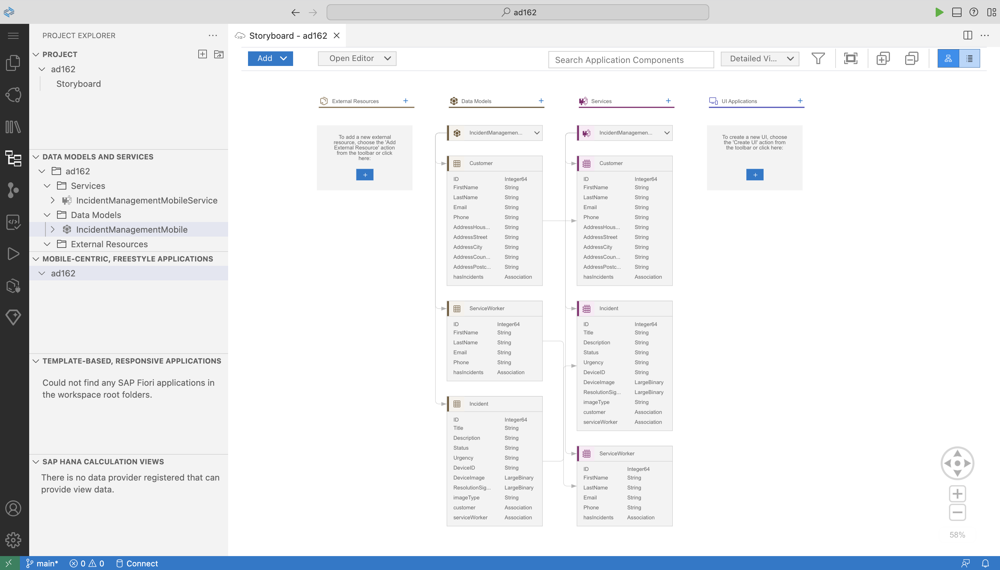

# AD162 - Develop Mobile Apps with SAP Build Code, Access them via SAP Mobile Start

## Description

Accelerate development by using SAP Build Code to consume a SAP Cloud Application Programming (CAP) Model service for mobile development. Build a native, cross-platform mobile application using mobile development kit and bring all of your work together on the SAP Mobile Start app - the launchpad for mobile apps from SAP.

## Requirements

In order to complete the session exercises below, first complete the [pre-requisites](exercises/ex0//README.md).

## Use Case

ACME is a popular electronics company. ACME hires call center support representatives to process and manage customer incidents. A call center support representative (Processor) receives a phone call from an existing customer and creates a new incident on behalf of the customer. ACME employs technicians who use mobile apps to view process these incidents.

### Incident Creation (AD161)
- Mary reports an issue she is facing with her ACME electronic device.
- Raj, a support representative, logs the incident using the Incident Management app.
- Raj records Mary's contact information and issue details.

### Incident Resolution (AD162)
- Anna, a technician, uses the ACME Technician Incident Management app.
- Anna views the tasks assigned to her.
- Anna selects a task to view the details.
- Anna travels to Mary's location for on-site service.
- After fixing the issue, Anna uploads a resolution image.
- Anna requests Mary's digital signature for closing the incident.
- As a traveling technician, Anna accesses payroll and organizational news via the SAP Mobile Start app.
- She easily launches the Incident Management app from SAP Mobile Start.

## Understand your SAP Cloud Application Programming Backend

The back-end for this Hands-On session (AD162) has been created using SAP Cloud Application Programming Model, which in turn connects to a HANA DB. Three entities are defined in the `schema.cds` file and then exposed as a service.
  

This session will focus on building a mobile application using a SAP Cloud Application Programming back-end. To learn more about how to build a back-end using SAP Cloud Application Programming Model, please check out the session AD161.

## Exercises

| Exercise Number | Title | Estimated Time (mins) |
| ---- | ---- | --- |
| [Exercise 1](exercises/ex1/README.md) | Run the Starting Application on Your Device | 10 |
| [Exercise 2](exercises/ex2/README.md) | Enhance the generated Incidents List and Detail page | 20 |
| [Exercise 3](exercises/ex3/README.md) | Modify an Incident Record | 35 |
| [Exercise 4](exercises/ex4/README.md) | Integrate with SAP Mobile Start | 25 |

## How to obtain support

Support for the content in this repository is available during the actual time of the online session for which this content has been designed. Otherwise, you may request support via the [Issues](../../issues) tab.

## Additional Support and Learning Resources

- Continue your learning with additional [MDK tutorials](https://help.sap.com/doc/f53c64b93e5140918d676b927a3cd65b/Cloud/en-US/docs-en/guides/getting-started/mdk/overview.html#tutorials)

- Check out the SAP Community for [Mobile Development](https://community.sap.com/topics/mobile-technology) & [Mobile Experience](https://community.sap.com/topics/mobile-experience)

- Learn more about SAP Cloud Application Programming Model by [visting the official documentation](https://cap.cloud.sap/docs/) and [with these additional resources](https://cap.cloud.sap/docs/resources/)

## License
Copyright (c) 2023 SAP SE or an SAP affiliate company. All rights reserved. This project is licensed under the Apache Software License, version 2.0 except as noted otherwise in the [LICENSE](LICENSES/Apache-2.0.txt) file.
