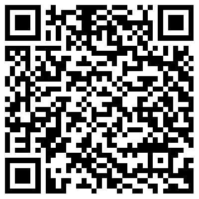

# Getting Started

Before beginning the session exercises, please ensure that you have installed the **SAP Mobile Services Client** and **SAP Mobile Start** apps from the public store. You can expedite the installation process by using the provided QR codes.

| Apps      | Android | iOS     |
| :---:        |    :----:   |  :---: |
| SAP Mobile Services Client      |        |    |
| SAP Mobile Start      |        |    |

## Summary

You have now fulfilled the prerequisite needed to start the session exercises. 

## Navigation

| Next |
|---|
| [Exercise 1](../ex1/README.md) |