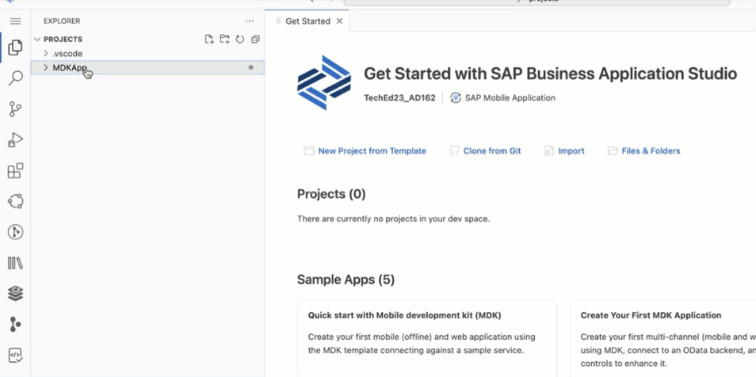
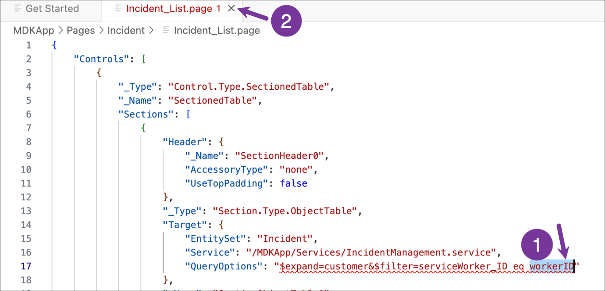
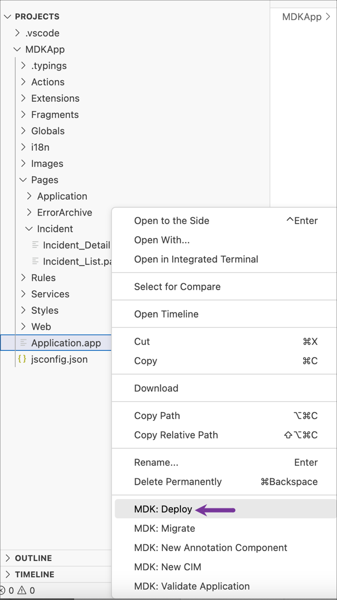
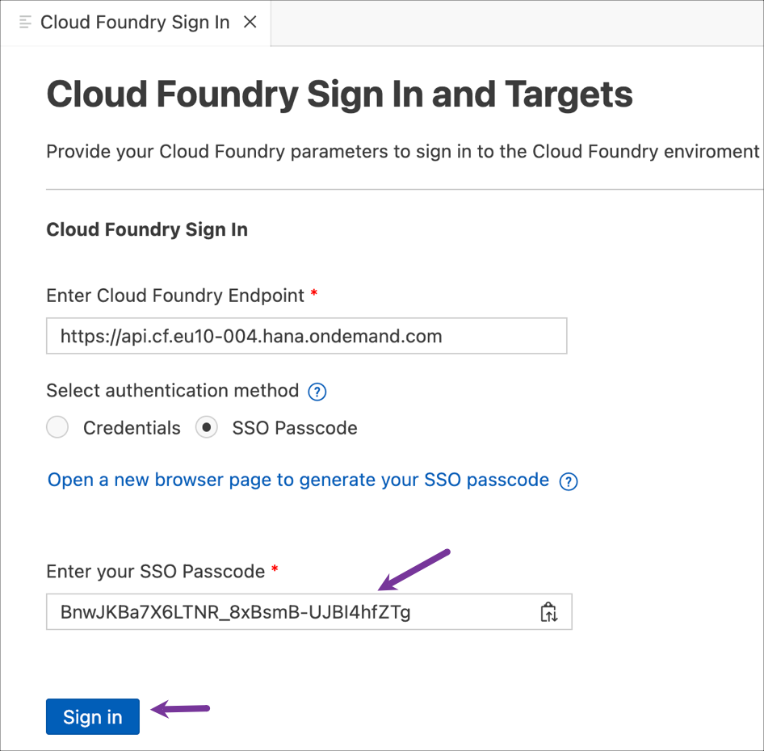
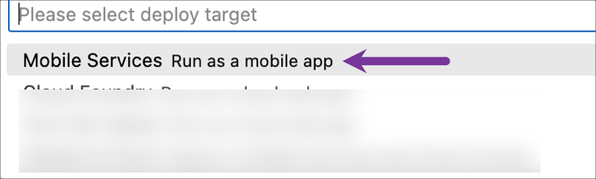
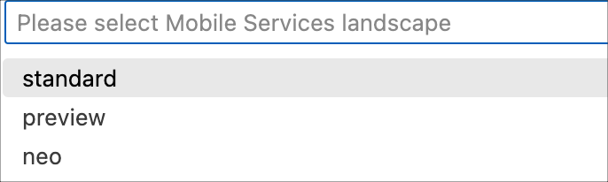
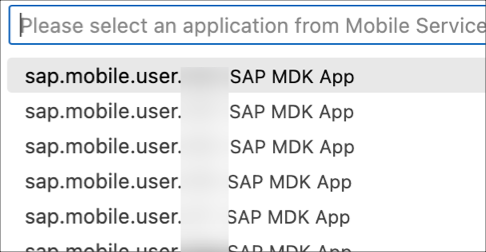
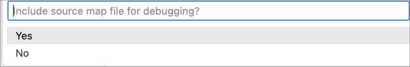
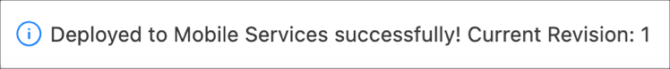

# Exercise 1 - Run the Starting Application on Your Device

## Estimated time

:clock4: 10 minutes

## Objective

In this exercise, you will run a starting SAP Mobile Development Kit (MDK) application on your device.

| Exercise Number | Title |
| --- | --- |
| [Exercise 1.1](#exercise-11---launch-the-sap-business-application-studio-for-mdk-development) | Launch the SAP Business Application Studio for MDK Development |
| [Exercise 1.2](#exercise-12---change-the-workspace-to-the-project-explorer) | Change the workspace to the Project Explorer |
| [Exercise 1.3](#exercise-13---provide-your-assigned-service-worker-id-to-filter-related-incidents) | Provide your assigned Service Worker ID to filter related Incidents |
| [Exercise 1.4](#exercise-14---deploy-the-application) | Deploy the application |
| [Exercise 1.5](#exercise-15---display-the-qr-code-for-onboarding-the-mobile-app) | Display the QR code for onboarding the Mobile app |
| [Exercise 1.6](#exercise-16---run-the-app) | Run the app |

### Exercise 1.1 - Launch the SAP Business Application Studio for MDK Development 

1. Launch the [SAP Business Application Studio](https://ad162-egls99xc.eu10cf.applicationstudio.cloud.sap/index.html) in the Google Chrome browser.

    >Cancel the selection of the user certificate if a prompt appears in the browser.

2. Provide the login credentials that were shared with you during the session. 

    

3. If your dev space is in `STOPPED` state, start it by clicking on the run icon.

      

    Once it's in the `RUNNING` state, open it by clicking on the name.    

     

### Exercise 1.2 - Change the workspace to the Project Explorer

You will now switch your workspace to the `projects` folder.

1. Click on the Explorer icon and select **Open Folder**.

     

2. If not already selected, choose the `projects` folder and click **OK**.

     

    The SAP Business Application Studio page will reload, and the projects folder will now open as the workspace. You will find your `MDKApp` project. 

          

### Exercise 1.3 - Provide your assigned Service Worker ID to filter related Incidents

1. Expand the `MDKApp` project and navigate to `Pages` &rarr; `Incident`. Right-click on the `Incident_List.page` and open with **Text Editor**.

       

2. Replace the `workerID` with a Service Worker ID value shared with you and then close the page by clicking the `x` sign.

      

### Exercise 1.4 - Deploy the application

You will now deploy the application definitions to SAP Mobile Services.

1. Right-click `Application.app` and select **MDK: Deploy**.

     

2. If you don't have an active CF session, you may be prompted to log into Cloud Foundry. If prompted, click **Login** to continue. If not, proceed directly to step 8.

    

3. Choose the **SSO Passcode** as your authentication method, then click on the highlighted hyperlink. This will open a new browser page.

    

4. A new tab will open in your browser. Enter  `tdct3ched1-platform` as the origin key for the custom IdP, then click on **Sign in with alternative identity provider**.

    

    > Cancel the certificate selection if you are prompted to do so in the browser.

5. Copy the Temporary Authentication Code.

    

6. Switch back to the SAP Business Application Studio page. Paste the copied code into the field labeled **Enter your SSO Passcode** and then click **Sign In**.

    

7. You are now signed in to the Cloud Foundry. Set the Cloud Foundry target by choosing the appropriate Organization and space from the dropdown menu and then click on **Apply**. Once the Cloud Foundry target is set, the `Cloud Foundry Sign in` tab will automatically close.

    
    
8. Select deploy target as **Mobile Services**.

     

9. Select **Standard** Mobile Services Landscape**.

      

10. Select the Mobile Services App ID `sap.mobile.user.xyz` assigned to you.

     

11. If you want to enable source for debugging the deployed bundle, then choose **Yes**.

     

    You should see **Deploy to Mobile Services successfully!** message.

     

### Exercise 1.5 - Display the QR code for onboarding the Mobile app

You will now run the initial application on the Mobile client installed on your device by scanning the on-boarding QR code. 

1. Expand the `MDKApp` project, click the `Application.app` to open it in MDK Application Editor and then click the **Application QR Code** icon.

    

2. The On-boarding QR code is now displayed. Leave the Onboarding dialog box open as you proceed to the next step.

    

### Exercise 1.6 - Run the app

| Steps&nbsp;&nbsp;&nbsp;&nbsp;&nbsp;&nbsp;&nbsp;&nbsp;&nbsp;&nbsp; | Android | iOS&nbsp;&nbsp;&nbsp;&nbsp;&nbsp;&nbsp;&nbsp;&nbsp;&nbsp;&nbsp;&nbsp;&nbsp;&nbsp;&nbsp;&nbsp;&nbsp;&nbsp;&nbsp;&nbsp;&nbsp;&nbsp;&nbsp;&nbsp;&nbsp;&nbsp;&nbsp;&nbsp;&nbsp;&nbsp;&nbsp;&nbsp;&nbsp;&nbsp;&nbsp;&nbsp;&nbsp;&nbsp;&nbsp;  |
| --- | --- | --- |
| 1. Launch **`Mobile Svcs`** app on your mobile device. Tap **Agree** on `End User License Agreement and Privacy Statement`. |  |  |
| 2. Tap **Scan** to start the device camera for scanning the onboarding QR code and grant permission to access the camera. Please note, if you already have the MDK client on-boarded, tap *Get Started* and *Scan new QR code* to continue. |  |  |
| 3. Once the scan succeeds, tap **Continue**. |  |  |
| 4. Use the login credentials that were shared with you during the session to log into SAP BTP. |  |  |
| 5. Create a passcode that is at least 5 characters long to unlock the app, and then tap **Next**. |  |  |
| 6. Confirm the passcode and tap **Done**. |  |  |
| 7. You have the option to enable Biometric Authentication for faster access to app data. On iOS, tap **Enable** if you wish to use this feature. On Android, provide your biometric information. |  |  |
| 8. Tap **Next**. If you want your MDK client to send you notifications, tap **Allow**, otherwise, tap **Don't allow**. |   | NA |
| 9. Tap on **Now** to accept the deployed metadata definitions. |  |  |
| 10. After accepting the app update, the offline store will initialize. You'll see a list of incidents assigned to you and a user menu icon on the main page. The user menu includes the following items:  - **Sync Changes:** This allows you to upload any local changes from the Mobile client to the backend and download any delta changes from the backend to the Mobile client.  - **Support:** This provides an easy way for users to contact support via a contact cell. The contact information is defined in the global settings.  - **Activity Log** option on the Support page allows the user to toggle client logging on or off, set the log level, set tracing categories, toggle OData tracing and, if enabled in the Mobile Services application, upload the current client logs.   - **Check for Updates:** This checks if new Metadata has been deployed to the Mobile Services App Update. If new Metadata is found, it will be downloaded and prompt the user to apply the changes.  - **About:** This page displays the current user/device ID, Application Name, Metadata version, and Client version information.  - **Logout:** This completely resets the client, erasing any downloaded data and application Metadata, and returns the user to the license agreement screen. |  |  |
| 11. Tap on any of the incidents to navigate to the detail page, where you'll find more information about the incident. You can also access the customer's address via a maps application. If the incident is marked as `closed`, an option to view the image of the defective device will be available. |  |  |

>After scanning and onboarding using the URL, it will be remembered. If you log out and onboard again, you'll be prompted to either continue using the current application or to scan a new QR code.

## Summary

You now have the starting application running in your MDK client.

## Navigation

|  Next |
|---|
| [Exercise 2](../ex2/README.md) |
