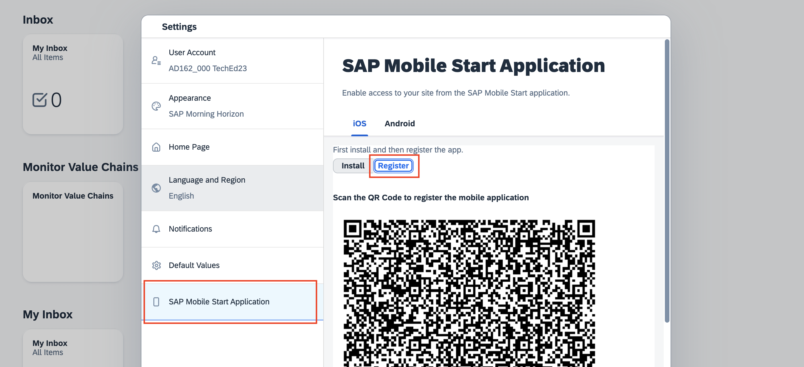

# Exercise 4 - Integrate with SAP Mobile Start

## Estimated time

:clock4: 10 minutes

## Objective

The SAP Mobile Start app is your native entry point to SAP’s mobile universe. Discover how custom apps appear in SAP Mobile Start and can be launched. Experience SAP Mobile Start on your own mobile device.

> **Please note:** Due to the limited time in the hands-on workshop, the required content in SAP Build Work Zone, standard edition has been pre-created for this session. You can check out further resources to learn more about how to expose such content to SAP Mobile Start on your own.

| Exercise Number   | Title                                                 |
|-------------------|-------------------------------------------------------|
| [Exercise 4.1](#exercise-41---access-work-zone-standard-edition) | Access Work Zone, standard edition |
| [Exercise 4.2](#exercise-42---configure-sap-mobile-start-application) | Configure SAP Mobile Start Application |

### Exercise 4.1 - Access Work Zone, standard edition

1. Open the [Site Manager](https://ad162-egls99xc.dt.launchpad.cfapps.eu10.hana.ondemand.com/sites#Site-Directory?sap-app-origin-hint=) of SAP Build Work Zone, standard edition in your browser.

   > **Please note:** As this environment is shared between all participants of this session, please do not change or delete content. Please use your own environment, for example using the [free tier of SAP BTP](https://discovery-center.cloud.sap/serviceCatalog/sap-build-work-zone-standard-edition/?region=all&tab=feature).

2. You can find a pre-created Site `AD162` in the Site Directory overview. Click on the **gear** icon to check the details.

   

      
   

3. On the right-hand side, you can observe content of an S/4HANA system for the **Purchaser** business role that has been added by your instructors for this course.

   

      
   

4. Go back and navigate now to the **Content Manager** on the left side of the Site Manager.

   

      
   

5. Here you can observe, two native apps have been created to represent your Pro-code native app both for iOS and Android.

   

      
   

6. Go back to the **Site Directory** and launch the prepared Site using the **launch** icon

   

      
   

7. In the Work Zone site, you can already see some business apps in your browser. Go to **Profile** and open the **Settings** on the top left.

   

      
   

8. Navigate to the section **SAP Mobile Start Application** and select **Register** to show the QR-Code which can be used for onboarding.
   
   

      
   

   > Ensure that you have chosen the right platform iOS / Android above.

### Exercise 4.2 - Configure SAP Mobile Start Application

| Steps&nbsp;&nbsp;&nbsp;&nbsp;&nbsp;&nbsp;&nbsp;&nbsp;&nbsp;&nbsp; | Android | iOS&nbsp;&nbsp;&nbsp;&nbsp;&nbsp;&nbsp;&nbsp;&nbsp;&nbsp;&nbsp;|
| --- | --- | --- |
| 1. Open **SAP Mobile Start** on your mobile phone. If you don't have it yet, install it from the App Store or Google Play. You can use the installation QRs to find the app quickly. |  |  |
| 2. After agreeing to the end user license agreement and the privacy policy, tap on the **Scan / Get Started** button in SAP Mobile Start. |  |  |
| 3. You will be asked to login with your provided credentials. Use the email address in the format `ad162-###@education.cloud.sap` (replacing `###` with your 3-digit number) and the password. | N/A | N/A |
| 4. Tap on the **Apps** tab at the bottom tab bar. You can see the app integrating our mobile app built in this course under the section **AD162 Apps** |  |  |
| 5. Tapping on it will launch the **Mobile Services Client** in order to try out your app. If it is not yet installed, you will be redirected to the App Store or Google Play. | N/A | N/A |

## Summary

You have learned how content integrated into SAP Build Work Zone, standard edition will appear in SAP Mobile Start. You experienced launching a native app from Mobile Start and how other example business content from S/4HANA can build the foundation for the native entry point to SAP’s mobile universe. Such content can be coming from Content Providers like S/4HANA or be customly built and integrated suiting your needs.

Learn more about SAP Mobile Start and how to expose content in the following two hands-on workshops of TechEd 2023:

- DT162 - Learn How to Set Up and Configure SAP Mobile Start with SAP S/4HANA
- XP161 - Develop Mobile Apps with SAP Build Apps, Access Them via SAP Mobile Start

## Navigation

| Previous | Next |
| --- | --- |
| [Exercise 3](../ex3/README.md) | [Conclusion](../../Conclusion.md) |